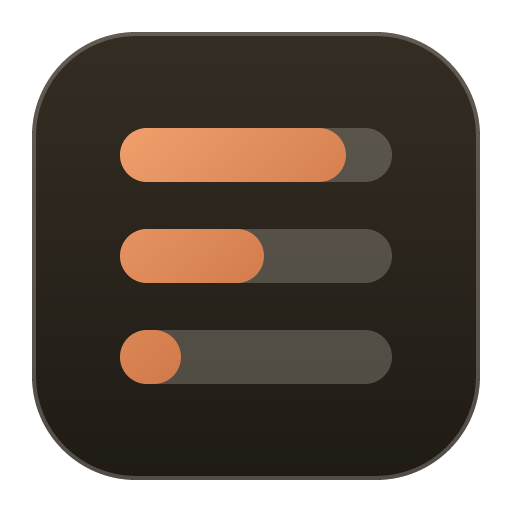

<p align="center">
  
</p>

<h1 align="center">TokenCue</h1>

<p align="center">
  A private, local-first tray dashboard for AI usage, limits, balances, cost, and service status.
</p>

<p align="center">
  <a href="https://github.com/Noliravena/TokenCue/actions/workflows/ci.yml"></a>
  <a href="LICENSE"></a>
  
  
</p>

## Features

TokenCue keeps provider usage close to the system tray without routing it through a TokenCue cloud service. This monorepo ships native desktop apps for Windows and macOS, a shared provider contract, CLI tools, and a sandboxed plugin protocol.

- One tray dashboard for quota windows, reset times, balances, spend, and service health
- Shared catalog of **67** AI providers with isolated refresh failures and explicit stale-data markers
- Multiple accounts and explicit authentication-source selection
- Adaptive refresh, manual refresh, local history, notifications, and usage-pace warnings
- Dark and light themes, compact and expanded provider views, dedicated settings
- Matching CLI for `usage`, `cost`, `diagnose`, `sessions`, `serve`, `config`, `hooks`, `guard`, and `plugins`
- Permission-based JavaScript/TypeScript plugin runtime with network allowlists, timeouts, response limits, and no arbitrary filesystem or subprocess access

## Status

TokenCue is a **source-first developer preview**. There are no signed installers, notarized builds, package-manager releases, or automatic updates yet. Do not treat development binaries as production releases.

| Platform | Minimum version | Status |
| --- | --- | --- |
| Windows | Windows 11 | Development build compiled, tested, and exercised on a native Windows desktop |
| macOS | macOS 15 | Source complete for Apple Silicon and Intel; validation on a Mac is still required |

## Privacy

TokenCue is local-first:

- Provider failures are isolated; the last successful snapshot can remain visible as stale data
- Sensitive values use user-scoped platform storage (Windows DPAPI / Credential Manager; macOS Keychain), not ordinary config files
- Browser sessions are never read automatically on first launch; the user chooses a provider and authorization source
- Logs, diagnostics, CLI JSON, fixtures, and plugin responses pass through redaction rules
- Cost is grouped by native currency and is never silently converted or summed across currencies

Short security bullets live here; full reporting process and trust boundaries are in [SECURITY.md](SECURITY.md) and [docs/architecture.md](docs/architecture.md).

## Repository layout

```text
apps/
  windows/     Tauri 2 + React + Rust desktop app (`tokencue-desktop`) and Rust CLI (`tokencue`)
  macos/       SwiftUI / AppKit app, Swift provider engine, and Swift CLI
shared/        Provider catalog, schemas, design tokens, locales, plugin fixtures
scripts/       Contract generation, consistency checks, security gates
docs/          Architecture, design system, upstream policy, acceptance checklists
```

## Documentation

Full documentation index: **[docs/README.md](docs/README.md)**

| Document | Purpose |
| --- | --- |
| [docs/architecture.md](docs/architecture.md) | Data flow, shared contracts, auth and plugin boundaries |
| [docs/design-system.md](docs/design-system.md) | Tokens, palette, geometry, thresholds |
| [docs/plugin-protocol.md](docs/plugin-protocol.md) | Sandboxed provider plugin host protocol |
| [docs/upstream-policy.md](docs/upstream-policy.md) | Import-pin process (external product sync disabled) |
| [docs/acceptance/windows.md](docs/acceptance/windows.md) | Windows 11 development-build acceptance record |
| [docs/acceptance/macos.md](docs/acceptance/macos.md) | macOS 15 validation checklist |

## Windows development

### Requirements

- Windows 11
- Git
- Node.js 20 and Corepack
- Rust stable with the MSVC toolchain
- Visual Studio Build Tools with Desktop development with C++
- Microsoft Edge WebView2 Runtime

### Desktop app

```powershell
corepack enable
pnpm --dir apps/windows/apps/desktop-tauri install --frozen-lockfile
pnpm --dir apps/windows/apps/desktop-tauri run tauri:dev
```

Build a local debug executable:

```powershell
pnpm --dir apps/windows/apps/desktop-tauri run tauri:build:debug
```

The executable is written to `apps/windows/target/debug/tokencue-desktop.exe`.

### CLI

```powershell
cargo run --manifest-path apps/windows/Cargo.toml -p tokencue -- --help
```

Platform entry and acceptance notes: [apps/windows/README.md](apps/windows/README.md) · [docs/acceptance/windows.md](docs/acceptance/windows.md)

## macOS development

### Requirements

- macOS 15 or newer
- Xcode command-line tools
- Swift 6 toolchain

```bash
cd apps/macos
swift build
make test
make check
swift run TokenCue
```

Complete [docs/acceptance/macos.md](docs/acceptance/macos.md) before describing a macOS build as verified.

Platform entry: [apps/macos/README.md](apps/macos/README.md)

## Validation

Cross-platform contracts and secret-shape checks:

```bash
pnpm run generate
pnpm run check
```

Windows frontend and Rust checks:

```powershell
pnpm --dir apps/windows/apps/desktop-tauri test
pnpm --dir apps/windows/apps/desktop-tauri run build
cargo fmt --manifest-path apps/windows/Cargo.toml --all -- --check
cargo clippy --manifest-path apps/windows/Cargo.toml --workspace --all-targets -- -D warnings
cargo test --manifest-path apps/windows/Cargo.toml --workspace
```

Automated tests never require real provider credentials. Live provider smoke tests must be explicitly authorized and run with dedicated test accounts.

## Contributing

Bug reports, provider adapters, parser fixtures, accessibility improvements, localization, and documentation fixes are welcome.

- [CONTRIBUTING.md](CONTRIBUTING.md) — how to contribute
- [CODE_OF_CONDUCT.md](CODE_OF_CONDUCT.md) — community standards
- [SUPPORT.md](SUPPORT.md) — where to get help
- [SECURITY.md](SECURITY.md) — private vulnerability reporting

General questions: [GitHub Discussions](https://github.com/Noliravena/TokenCue/discussions). Reproducible bugs: [GitHub Issues](https://github.com/Noliravena/TokenCue/issues).

## License

TokenCue is available under the [MIT License](LICENSE). Required notices for third-party components are collected in [THIRD_PARTY_NOTICES.md](THIRD_PARTY_NOTICES.md).
